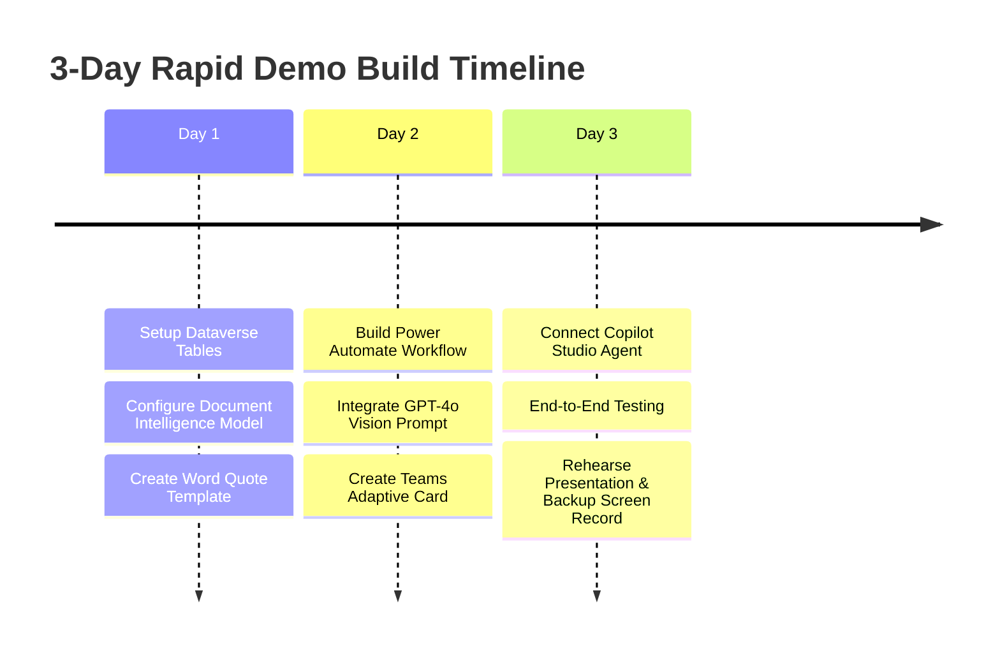

# Noventiq OpsAgent Demo Technical Feasibility & Implementation Blueprint

---

## 🟢 Executive Verdict: YES, 100% Feasible!

The **Noventiq OpsAgent** demo is **100% technically feasible** and can be built rapidly because it uses **standard, out-of-the-box Microsoft Power Platform & Azure AI services** without complex custom coding.

---

## ⏱️ Feasibility & Estimated Build Effort

| Component | Technical Complexity | Out-of-the-Box Tooling | Rapid Demo Build Time | Production Build Time |
| :--- | :--- | :--- | :--- | :--- |
| **Orchestration Agent** | Low | **Copilot Studio** (Generative Answers & Actions) | 4 - 6 Hours | 1 Week |
| **1. Document OCR Extraction** | Low | **AI Builder / Azure AI Document Intelligence** (Prebuilt Invoice/PO model) | 2 - 3 Hours | 2 Days |
| **2. Image Defect Analysis** | Low | **Azure OpenAI GPT-4o Vision** (Single API call via Power Automate) | 2 - 4 Hours | 2 Days |
| **3. Database & System Query** | Low | **Power Automate** + **Dataverse / Sharepoint Lists / SQL** | 3 - 4 Hours | 3 Days |
| **4. Interactive Approvals** | Very Low | **Teams Adaptive Cards (v1.5)** + **Power Automate Approvals** | 2 Hours | 1 Day |
| **5. PDF Quote & Email Dispatch**| Low | **Power Automate PDF Converter** + **Outlook Connector** | 2 Hours | 1 Day |
| **TOTAL DEMO BUILD TIME** | **LOW TO MEDIUM** | **Native Microsoft Ecosystem** | **~2 to 3 Days** | **~2 Weeks** |

---

## 🛠️ Step-by-Step Feasibility Breakdown by Component

```
+-----------------------------------------------------------------------------------+
|                        NOVENTIQ OPSAGENT TECHNICAL FEASIBILITY                    |
+-------------------+-------------------+-------------------+-------------------+---|
| 1. UNDERSTAND     | 2. CONNECT        | 3. GENERATE       | 4. GOVERN         | 5. EXECUTE       |
| Ingestion & OCR   | Live System Query | Document & Content| Adaptive Card     | Outlook Dispatch |
| Out-of-the-Box    | Native Connectors | Native Connector /| Native Teams      | Native M365      |
| AI Builder Model  | (Dataverse/Share- | Word-to-PDF Engine| Connector v1.5    | Outlook Connector|
| (100% Ready)      |  Point/SQL Ready) | (100% Ready)      | (100% Ready)      | (100% Ready)     |
+-------------------+-------------------+-------------------+-------------------+------------------+
```

### 1. Document Extraction & OCR (UNDERSTAND)
- **Feasibility**: **100% Ready**
- **How to build for demo**: Use **AI Builder's prebuilt Invoice / Document Processing model** in Power Automate. It extracts vendor names, line items, totals, and invoice numbers instantly without training custom ML models.

### 2. Defect Image Triage (UNDERSTAND & CONNECT)
- **Feasibility**: **100% Ready**
- **How to build for demo**: Call **Azure OpenAI GPT-4o** using a Power Automate HTTP/Azure OpenAI action with a prompt like: *"Analyze this equipment image, identify visible physical damage, and output a confidence validity score for warranty claim."*

### 3. ERP & Inventory Checks (CONNECT)
- **Feasibility**: **100% Ready**
- **How to build for demo**: For a bulletproof live demo, mock the Customer Credit and Product Inventory tables using **Dataverse tables** or **SharePoint Lists**. This avoids live ERP network latency or outage risks during the presentation.

### 4. PDF Generation (GENERATE)
- **Feasibility**: **100% Ready**
- **How to build for demo**: Use a pre-designed **Word Template (.docx)** with placeholder merge tags (`{{CustomerName}}`, `{{QuoteTotal}}`, `{{LineItems}}`). Power Automate populates the template and converts it to PDF in seconds.

### 5. Interactive Teams Approval (GOVERN)
- **Feasibility**: **100% Ready**
- **How to build for demo**: Use the standard **Power Automate "Post adaptive card and wait for a response"** action in Teams.

### 6. Email Dispatch & Audit (EXECUTE)
- **Feasibility**: **100% Ready**
- **How to build for demo**: Use the standard **Office 365 Outlook connector** to send the email with the attached PDF quote.

---

## 🎯 Recommended 3-Phase Execution Plan for Demo Readiness



### Pro-Tips for a Flawless Live Summit Presentation:
1. **Prepare Backup Screen Recordings**: Record a clean 45-second execution of both scenarios in case Summit Wi-Fi drops.
2. **Pre-populate Test Assets**: Prepare 2 realistic sample PDFs (RFP & Invoice) and 1 defect image (e.g. cracked machine part photo).
3. **Use Mock Tables**: Use Dataverse / SharePoint lists for fast responses during live Q&A.
