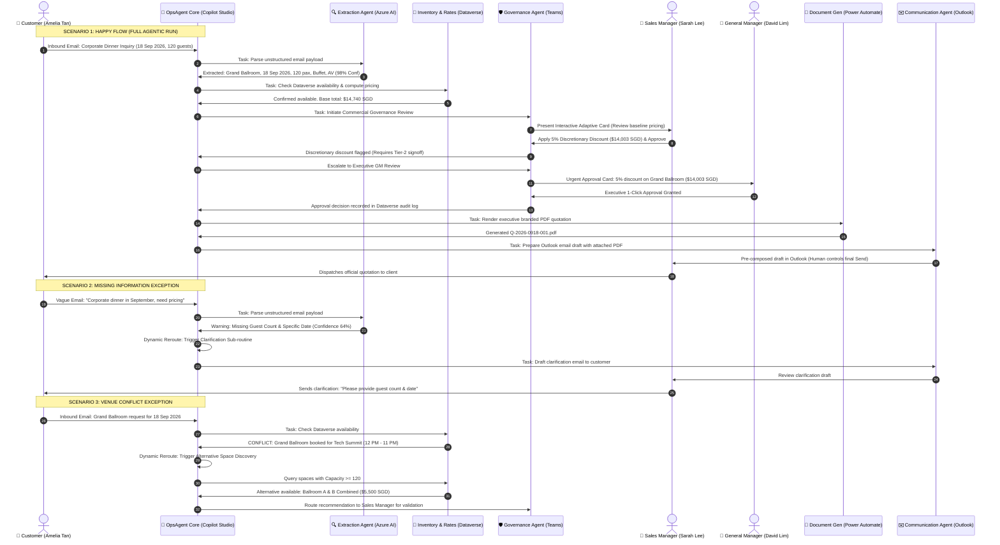

# Noventiq OpsAgent — Agentic AI Orchestration Architecture Specification

---

## 1. Executive Summary & Orchestration Paradigm

**Noventiq OpsAgent** represents a shift from rigid, sequential RPA bots to an **Autonomous Multi-Agent Orchestration Framework** built on the Microsoft 365 and Power Platform ecosystem. 

Rather than executing a hardcoded sequence of steps, a central reasoning engine (**Noventiq OpsAgent Core**) continuously evaluates incoming events, assesses data completeness, dynamically selects and commands specialized child agents, and handles edge cases (missing required information, calendar room conflicts, and out-of-policy discounts) while preserving **Human-in-the-Loop governance**.

---

## 2. Updated Agent Hierarchy & Naming Standards

| Agent Designation | Official System Name | Primary Technology Engine | Input Contract | Output Contract |
| :--- | :--- | :--- | :--- | :--- |
| **Central Orchestrator** | **Noventiq OpsAgent Core** | Microsoft Copilot Studio Orchestrator | Inbound customer intent, session context, agent status callbacks | Dynamic task delegation, agent coordination, state ledger |
| **Sub-Agent 1** | **Extraction Agent** | Azure AI Document Intelligence | Unstructured customer email / document attachments | Structured JSON entity payload (date, pax, room, AV, catering) + confidence score |
| **Sub-Agent 2** | **Inventory & Rates Agent** | Microsoft Dataverse Facility & Rate Card Ledger | Structured event specs (room, date, time slots, guest count) | Real-time calendar availability, conflict detection, itemized rate calculations |
| **Sub-Agent 3** | **Governance & Review Agent** | Microsoft Teams Adaptive Cards + Power Automate | Draft inquiry, pricing proposal, discretionary discount requests | 2-tier managerial sign-offs (Sales + GM), audit trail, policy compliance stamp |
| **Sub-Agent 4** | **Document Generation Agent** | Power Automate PDF Rendering Engine | Approved pricing payload, customer master data, approval stamp | Executive branded PDF quotation proposal (`Q-2026-0918-001.pdf`) |
| **Sub-Agent 5** | **Communication Agent** | Office 365 Outlook Connector | PDF quotation attachment, client contact, personalized body text | Pre-composed Outlook email draft in Sales Outbox (Human-governed send) |

---

## 3. High-Level Agentic Hierarchy & Dynamic Routing (Mermaid Flowchart)

```mermaid
flowchart TD
    subgraph ClientLayer["Inbound Channel"]
        CustomerEmail["📧 Customer Email / RFP Ingestion<br><i>(Amelia Tan - Contoso Events)</i>"]
    end

    subgraph CoreOrchestrator["Agentic Orchestration Core"]
        OpsCore["🧠 <b>NOVENTIQ OPSAGENT CORE</b><br><i>Microsoft Copilot Studio Orchestrator</i><br>• Reasoning Engine • Intent Router • Context & State"]
    end

    subgraph SubAgents["Specialised Child Sub-Agents"]
        AgentExtract["🔍 <b>Extraction Agent</b><br><i>Azure AI Document Intelligence</i><br>• Zero-Template OCR<br>• Field Confidence Scoring"]
        AgentInventory["📅 <b>Inventory & Rates Agent</b><br><i>Microsoft Dataverse Ledger</i><br>• Room Availability Query<br>• Rate Card Calculations"]
        AgentGovern["🛡️ <b>Governance & Review Agent</b><br><i>Teams Adaptive Cards</i><br>• Tier-1 Sales Review (Sarah Lee)<br>• Tier-2 GM Approval (David Lim)"]
        AgentDoc["📄 <b>Document Generation Agent</b><br><i>Power Automate PDF Engine</i><br>• Template Assembly<br>• Branded PDF Rendering"]
        AgentComm["✉️ <b>Communication Agent</b><br><i>Office 365 Outlook Connector</i><br>• Personalized Draft Generation<br>• Governed Final Dispatch"]
    end

    subgraph DecisionNodes["Dynamic Agentic Branching"]
        CheckExtract{"All Required<br>Fields Present?"}
        CheckConflict{"Calendar<br>Conflict Found?"}
        CheckDiscount{"Discretionary<br>Discount > 0%?"}
    end

    subgraph ExternalServices["Connected Enterprise Systems"]
        AzureDocAI[("Azure AI Services")]
        DataverseDB[("Microsoft Dataverse<br>Hotel Master DB")]
        TeamsClient["Microsoft Teams Client"]
        OutlookMailbox["Microsoft 365 Mailbox"]
    end

    %% Flow connections
    CustomerEmail --> OpsCore
    OpsCore <-->|"1. Delegate Extraction"| AgentExtract
    AgentExtract <--> AzureDocAI
    AgentExtract --> CheckExtract

    CheckExtract -->|"❌ Missing Fields (Scenario 2)"| OpsCore
    OpsCore -->|"Reroute to Clarification"| AgentComm
    AgentComm -->|"Send Clarification Email"| CustomerEmail

    CheckExtract -->|"✅ Complete (Scenario 1 & 3)"| OpsCore
    OpsCore <-->|"2. Delegate Inventory & Pricing"| AgentInventory
    AgentInventory <--> DataverseDB
    AgentInventory --> CheckConflict

    CheckConflict -->|"⚠️ Conflict Detected (Scenario 3)"| OpsCore
    OpsCore -->|"Auto-Discover Alternative Venue"| AgentInventory

    CheckConflict -->|"✅ Venue Available"| OpsCore
    OpsCore <-->|"3. Delegate Governance"| AgentGovern
    AgentGovern <--> TeamsClient
    AgentGovern --> CheckDiscount

    CheckDiscount -->|"Discretionary Discount (e.g. 5%)"| AgentGovern
    AgentGovern -->|"Tier-2 GM Escalation"| TeamsClient

    AgentGovern -->|"✅ All Approvals Granted"| OpsCore
    OpsCore <-->|"4. Delegate PDF Gen"| AgentDoc
    AgentDoc -->|"Generate Official PDF"| OpsCore

    OpsCore <-->|"5. Delegate Communication"| AgentComm
    AgentComm -->|"Create Outlook Draft"| OutlookMailbox
    OutlookMailbox -->|"Human-in-the-Loop Send"| CustomerEmail

    %% Styling
    classDef core fill:#0f3268,stroke:#3b82f6,stroke-width:2px,color:#ffffff;
    classDef agent fill:#eff6ff,stroke:#0284c7,stroke-width:1.5px,color:#0f172a;
    classDef decision fill:#fff7ed,stroke:#f97316,stroke-width:1.5px,color:#9a3412;
    classDef client fill:#f8fafc,stroke:#94a3b8,stroke-width:1px,color:#1e293b;
    classDef ext fill:#f0fdf4,stroke:#16a34a,stroke-width:1px,color:#14532d;

    class OpsCore core;
    class AgentExtract,AgentInventory,AgentGovern,AgentDoc,AgentComm agent;
    class CheckExtract,CheckConflict,CheckDiscount decision;
    class CustomerEmail client;
    class AzureDocAI,DataverseDB,TeamsClient,OutlookMailbox ext;
```

---

## 4. End-to-End Multi-Scenario Orchestration Sequence

---

## 5. Detailed Sub-Agent Specifications

### 5.1 Noventiq OpsAgent Core (Central Orchestrator)
- **Engine**: Microsoft Copilot Studio Orchestrator
- **Responsibility**:
  - Maintains conversation and booking context across multiple session turns.
  - Dynamically plans task execution trees rather than running static batch steps.
  - Enforces enterprise safety and compliance thresholds (e.g., maximum allowable discount, margin thresholds).
  - Handles runtime exceptions by routing to self-healing sub-routines (clarification emails, alternative venue suggestions).

### 5.2 Extraction Agent
- **Engine**: Azure AI Document Intelligence
- **Function**: Converts unformatted email bodies, Word attachments, and PDFs into verified JSON schemas without predefined templates.
- **Extracted Attributes**: Customer Name, Organization, Event Type, Room Preference, Event Date, Guest Count, Catering Type, AV Equipment, Stage Decoration.
- **Quality Gate**: Computes an aggregate extraction confidence score. If confidence is below 80% or mandatory booking fields are absent, flags an exception to OpsAgent Core.

### 5.3 Inventory & Rates Agent
- **Engine**: Microsoft Dataverse (Custom Entities: `ms_facility`, `ms_booking`, `ms_ratecard`)
- **Function**: Performs live transactional checks against room calendar ledgers.
- **Calculations**: Computes baseline commercial rate card:
  - Venue Rental (Grand Ballroom: $6,000 SGD / Ballroom A&B: $5,500 SGD)
  - Food & Beverage (120 pax × $45 SGD/pax = $5,400 SGD)
  - Audio/Visual Standard Package ($800 SGD)
  - Stage & Lighting Decoration ($400 SGD)
  - Taxes & Service Charges (10% Service Charge + 9% GST)
- **Conflict Handling**: Detects overlapping reservations down to 15-minute time slots.

### 5.4 Governance & Review Agent
- **Engine**: Microsoft Teams Adaptive Cards (v1.5 schema) + Power Automate
- **Function**: Implements a 2-tier approval workflow directly inside Microsoft Teams channels:
  - **Tier 1 (Sales Manager)**: Review baseline quote, input custom remarks, adjust discretionary discount (0% - 15%).
  - **Tier 2 (General Manager)**: Triggered automatically if discount > 0%, quote value > $10,000, or high-profile client.
- **Audit Trail**: Every approval action logs the approver's UPN, timestamp, IP, and decision directly to the Dataverse audit ledger.

### 5.5 Document Generation Agent
- **Engine**: Microsoft Power Automate PDF Engine
- **Function**: Merges Dataverse pricing tables, client master details, terms & conditions, and executive sign-off stamps into a PDF document.
- **Outputs**: High-resolution branded proposal (`Q-2026-0918-001.pdf`) featuring itemized tables, payment terms, cancellation policies, and digital verification seal.

### 5.6 Communication Agent
- **Engine**: Microsoft 365 Outlook Connector
- **Function**: Assembles the customer-facing response email.
- **Governance Safe-Guard**: Prepares the message as an **Outlook Draft** inside the sales team's mailbox rather than auto-sending without human oversight, ensuring the sales team retains final commercial control.
