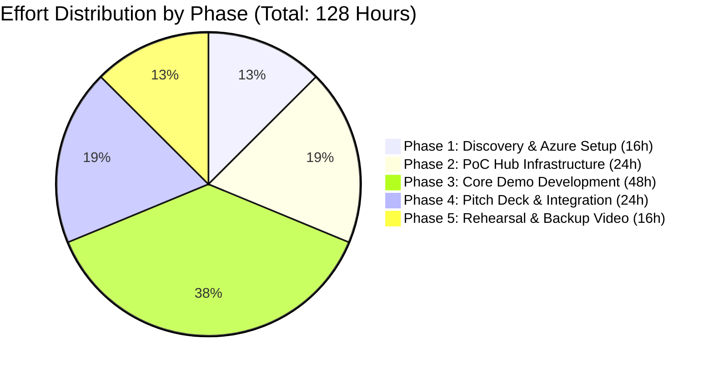

# Noventiq OpsAgent Effort Estimation & Man-Hour Breakdown

---

## 📊 Executive Summary

- **Total Estimated Effort**: **128 Man-Hours** (~3.2 Man-Weeks total across team resources)
- **Primary Roles Involved**:
  - **Power Platform & Agentic AI Solutions Architect**: ~48 Hours
  - **Power Automate & Azure AI Engineer**: ~44 Hours
  - **Business Transformation & Pitch Lead (Raymond Chow)**: ~24 Hours
  - **Quality Assurance & Demo Coordinator**: ~12 Hours
- **Project Window**: 6 Weeks (17 Aug 2026 – 28 Sept 2026)

---

## 🛠️ Work Package (WP) Man-Hour Breakdown



---

### Phase 1: Research, Architecture & Azure Setup (Weeks 1)
**Total Phase Effort**: **16 Man-Hours**

| Work Item | Role | Hours | Description |
| :--- | :--- | :--- | :--- |
| **WP 1.1 Requirements & Sample Data Alignment** | Solution Architect | 4h | Collect sample RFPs, POs, Tax Invoices, and damage photos. |
| **WP 1.2 Azure AI Infrastructure Provisioning** | AI Engineer | 4h | Provision Azure AI Document Intelligence & Azure OpenAI GPT-4o deployments. |
| **WP 1.3 M365 & Power Platform Environment Setup** | Solution Architect | 8h | Configure Dataverse environment, DLP policies, and Copilot Studio connections. |

---

### Phase 2: PoC Hub Infrastructure & AI Setup (Week 2)
**Total Phase Effort**: **24 Man-Hours**

| Work Item | Role | Hours | Description |
| :--- | :--- | :--- | :--- |
| **WP 2.1 Dataverse Schema & Mock Ledgers** | Solution Architect | 8h | Design and build Customer Master, Credit, Inventory, and Defect Code tables. |
| **WP 2.2 OCR Model Calibration** | AI Engineer | 8h | Configure & test Document Intelligence model on sample RFPs/Invoices. |
| **WP 2.3 GPT-4o Vision Prompt Engineering** | AI Engineer | 8h | Tune vision prompts for equipment defect detection and validity scoring. |

---

### Phase 3: Core Demo & PoC Development (Weeks 3 & 4)
**Total Phase Effort**: **48 Man-Hours** *(Largest Work Block)*

| Work Item | Role | Hours | Description |
| :--- | :--- | :--- | :--- |
| **WP 3.1 Process 1 Power Automate Workflows** | AI Engineer | 12h | Build RFP Ingestion, Credit Check, Inventory Lookup, & PDF Quote Generation flows. |
| **WP 3.2 Process 2 Power Automate Workflows** | AI Engineer | 12h | Build Warranty Claim processing, Vision Triage, & Stock Reservation flows. |
| **WP 3.3 Teams Adaptive Cards (v1.5) Development**| Solution Architect | 8h | Design 1-click Approval Cards for Sales/Finance and Credit Note write-offs. |
| **WP 3.4 Copilot Studio Agent Orchestration** | Solution Architect | 16h | Build Agent topics, action triggers, generative responses, and fallback handling. |

---

### Phase 4: Pitch Preparation & System Integration (Week 5)
**Total Phase Effort**: **24 Man-Hours**

| Work Item | Role | Hours | Description |
| :--- | :--- | :--- | :--- |
| **WP 4.1 Pitch Deck & Storyboard Creation** | Pitch Lead (Raymond) | 12h | Build 6-Slide presentation deck following the **3-6-5 Playbook**. |
| **WP 4.2 End-to-End System Testing & Tuning** | QA / Demo Coordinator | 8h | Perform end-to-end dry runs of both demo scenarios; tune latency. |
| **WP 4.3 Booth Strategy & Assessment Collateral** | Pitch Lead / SA | 4h | Prepare 1-day 3-6-5 AI Assessment collateral for booth visitors. |

---

### Phase 5: Internal Freeze, Rehearsals & Failsafe Video (Week 6)
**Total Phase Effort**: **16 Man-Hours**

| Work Item | Role | Hours | Description |
| :--- | :--- | :--- | :--- |
| **WP 5.1 Failsafe Screen Recording & Editing** | QA / Demo Coordinator | 6h | Record 4K screen capture of both flows as backup against venue Wi-Fi drops. |
| **WP 5.2 Leadership Rehearsals & Final Polish** | Pitch Lead / SA | 10h | Executive rehearsals with Noventiq leads & final pitch refinement. |

---

## 👥 Effort Summary by Role

```
+-----------------------------------------------------------------------------------+
|                        RESOURCE ALLOCATION BREAKDOWN                              |
+---------------------------------------------+-------------------------------------+
| Role                                        | Total Hours Dedicated               |
+---------------------------------------------+-------------------------------------+
| Power Platform & Agentic AI Architect       | 48 Hours (~1.2 Weeks)               |
| Power Automate & Azure AI Engineer          | 44 Hours (~1.1 Weeks)               |
| Business Transformation Lead (Pitch Owner)  | 24 Hours (~0.6 Weeks)               |
| QA & Demo Coordinator                       | 12 Hours (~0.3 Weeks)               |
+---------------------------------------------+-------------------------------------+
| TOTAL PROJECT EFFORT                        | 128 Hours (~3.2 Man-Weeks)          |
+---------------------------------------------+-------------------------------------+
```
