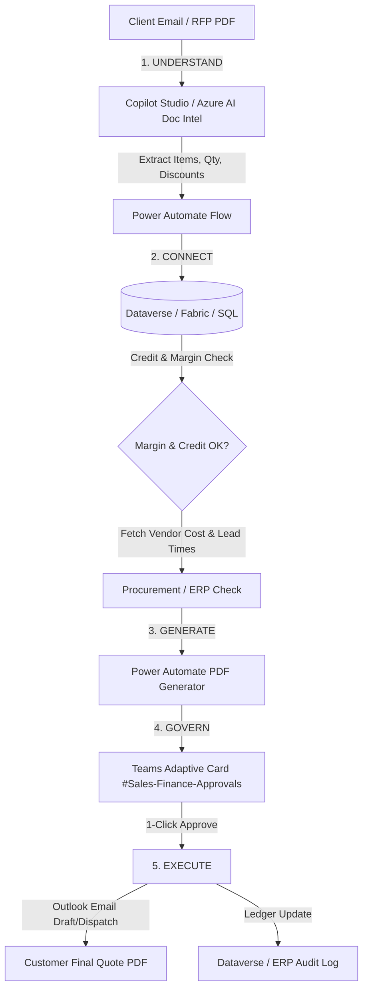
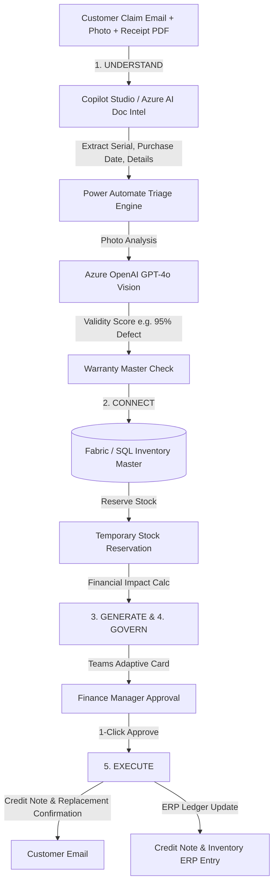

# Noventiq OpsAgent Solution Architecture & Implementation Plan

---

## Executive Summary & Strategic Context

**Noventiq OpsAgent** is a low-code/no-code Microsoft 365 & Power Platform agentic framework designed for regional SMEs to achieve capital-efficient AI capabilities.

As outlined in the **"3-6-5 Playbook for Capital-Efficient AI Capabilities"**, this architecture operationalizes Microsoft M365 and Copilot Studio across **3 Phases**, **6 Weeks**, and **5 Universal Capabilities** without complex custom code or multi-million-dollar AI engineering budgets.

### The 5 Universal Capabilities Framework

```
+-----------------------------------------------------------------------------------+
|                  ORCHESTRATION CORE: MICROSOFT COPILOT STUDIO                    |
+-------------------+-------------------+-------------------+-------------------+---|
| 1. UNDERSTAND     | 2. CONNECT        | 3. GENERATE       | 4. GOVERN         | 5. EXECUTE       |
| Ingestion & OCR   | Live System Query | Document & Content| Adaptive Card     | Outlook Dispatch |
| (Outlook + AI     | (Fabric OneLake / | (Power Automate   | (1-Click Approval)| & Ledger Update  |
|  Builder/DocIntel)|  ERP / SQL)       |  PDF Engine)      |                   |                  |
+-------------------+-------------------+-------------------+-------------------+------------------+
```

---

## Process 1: Specialized B2B Order Processing & Custom Quote Approval

### End-to-End Workflow & Capabilities Mapping



### Detailed Architecture & Technical Delivery

| Step & Department | Business Action | Copilot & Automation Delivery | Microsoft Tech Stack Used |
| :--- | :--- | :--- | :--- |
| **Step 1: Sales** *(Ingestion)* | Receives unformatted RFP, custom PO, or price request (PDF/Word) from client via email or shared channel. | OpsAgent automatically ingests document, extracts line items, quantities, delivery dates, and requested discounts via pre-built zero-template AI models. | • **Copilot Studio** (Agent Orchestrator)<br>• **Azure AI Document Intelligence** (Unstructured table & KV extraction) |
| **Step 2: Finance** *(Credit & Margin Audit)* | Verifies customer credit balance, outstanding invoices, exchange rates, and profit margin rules. | Triggers background flow querying historical pricing ledgers, checking credit limits, calculating multi-currency margins against target thresholds. | • **Power Automate**<br>• **Dataverse / Microsoft Fabric OneLake** (Customer master credit & pricing ledgers) |
| **Step 3: Procurement** *(Cost & Lead Time)* | Verifies vendor cost prices, inventory levels, and MOQs prior to quote confirmation. | Queries supplier catalog databases / ERP inventory tables via Copilot Studio Action Plugins to pull unit costs and shipping timelines. | • **Power Automate Connectors** (ERP/SQL/Supplier API)<br>• **Copilot Studio Action Plugins** |
| **Step 4: Approval** *(Cross-Functional Sign-off)* | Management approval required if discount exceeds threshold or credit limit is tight. | Posts interactive Adaptive Card summary in `#Sales-Finance-Approvals` channel tagging Sales Director & Finance Lead. Upon 1-click approval, dispatches quote. | • **Teams Adaptive Cards** (Schema v1.5)<br>• **Outlook / Power Automate** (Email quote PDF to client) |

---

## Process 2: After-Sales Warranty Claim, Technical Triage & Credit Resolution

### End-to-End Workflow & Capabilities Mapping



### Detailed Architecture & Technical Delivery

| Step & Department | Business Action | Copilot & Automation Delivery | Microsoft Tech Stack Used |
| :--- | :--- | :--- | :--- |
| **Step 1: Customer Service** *(Claim Ingestion)* | Customer submits warranty claim via email/portal with photo of damaged part and PDF tax invoice. | Claim forwarded to OpsAgent. Document Intelligence extracts serial numbers, purchase dates, customer details, and line item specifics. | • **Copilot Studio** (Channel Interface)<br>• **Azure AI Document Intelligence** |
| **Step 2: Technical Team** *(Diagnostic Triage)* | Engineering verifies serial warranty status and checks for known defect patterns. | Inspects serial number against warranty ledgers and runs vision processing on fault photo to output a technical validity score (e.g., *95% Valid Manufacturing Defect*). | • **Azure OpenAI GPT-4o Vision** (Fault photo evaluation)<br>• **Power Automate** (Asset warranty master checks) |
| **Step 3: Inventory** *(Stock Reservation)* | Warehouse verifies physical stock availability for replacement unit or spare part. | Queries warehouse stock across regional distribution hubs in real-time and places a temporary stock reservation for fulfillment. | • **Power Automate Flow**<br>• **Microsoft Fabric / SQL Database** (Inventory & ERP tables) |
| **Step 4: Finance** *(Credit & Tax Write-off)* | Finance calculates credit note value, replacement cost, shipping, and tax adjustments. | Calculates financial impact, prepares credit note payload, and routes an Adaptive Card to Finance Manager for 1-click authorization. | • **Teams Adaptive Cards** (Finance authorization)<br>• **Power Automate / Outlook** (ERP update & credit confirmation email) |

---

## 3-6-5 Implementation Roadmap (6-Week SME Plan)

| Phase | Weeks | Strategic Focus | Deliverables & Milestones |
| :--- | :--- | :--- | :--- |
| **Phase 1: Foundation & Governance** | **Week 1 - 2** | Data Hygiene, Environment & Governance Setup | • Dataverse / Fabric schema setup for Customer Master & Product Ledger<br>• Azure AI Document Intelligence & OpenAI resource provisioning<br>• Governance & DLP policies in Power Platform Admin Center |
| **Phase 2: Core Capability Integration** | **Week 3 - 4** | Understand, Connect & Generate Implementation | • Copilot Studio topic triggers & Outlook/Teams channels<br>• Power Automate flows connecting Fabric/SQL/ERP<br>• Document Intelligence models & GPT-4o Vision prompt engineering |
| **Phase 3: Automation & Rollout** | **Week 5 - 6** | Govern, Execute & Cross-Functional Rollout | • Teams Adaptive Card v1.5 approval cards deployment<br>• Outlook dispatch & automated ERP ledger updating<br>• End-to-end UAT, performance tuning, and executive Summit presentation |

---

## Key Benefits for SMEs

1. **Speed to Value**: Implementation completed in **6 Weeks** using native M365 ecosystem tools.
2. **Zero Maintenance Overhead**: Uses managed low-code architecture (Copilot Studio + Power Automate + Dataverse/Fabric) rather than custom code bases.
3. **Drastic Operational Reduction**: Reduces multi-day manual inquiry-to-quote and warranty claim cycles down to **30-second automated decisions**.
