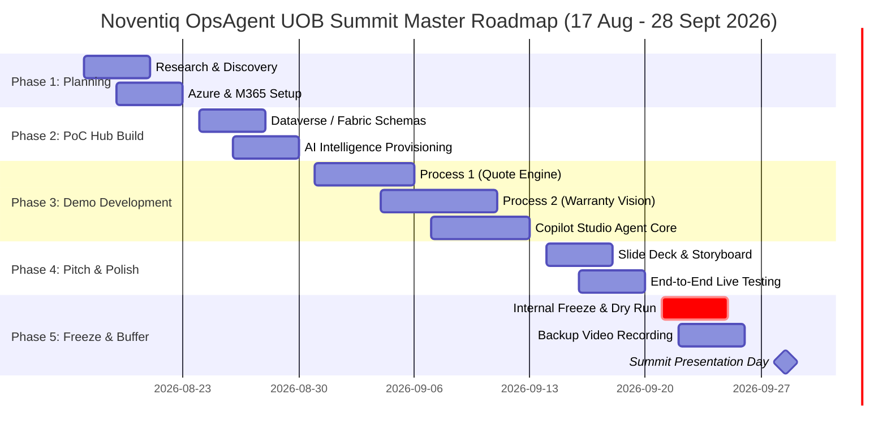

# Master Project Plan & Timeline: Noventiq OpsAgent UOB Summit

## 📅 Executive Timeline Overview

- **Start Date**: Monday, 17 August 2026  
- **Internal Freeze Date (1 Week Prior)**: Monday, 21 September 2026  
- **Event Date**: Monday, 28 September 2026  
- **Total Working Window**: 6 Weeks (5 Weeks Active Build + 1 Week Dry Run/Buffer)

---

## 🗓️ Phase-by-Phase Timeline Breakdown

---

## 📑 Detailed Work Breakdown Structure (WBS)

### Phase 1: Research, Architecture & Azure Environment Provisioning
**Dates**: 17 Aug – 23 Aug 2026 (Week 1)
- **Research & Requirements Alignment**:
  - Finalize sample document schemas (B2B RFP PDF, Purchase Orders, Tax Invoice Receipt).
  - Finalize equipment defect photos for GPT-4o Vision triage demonstration.
- **Azure & Power Platform Tenant Setup**:
  - Provision Azure AI Document Intelligence service instance.
  - Provision Azure OpenAI Service instance (Deploy `gpt-4o` vision model endpoint).
  - Configure Power Platform environment (Dataverse, Copilot Studio, Power Automate DLP rules).

---

### Phase 2: PoC Hub & Data Infrastructure Setup
**Dates**: 24 Aug – 30 Aug 2026 (Week 2)
- **Dataverse & Fabric OneLake Setup**:
  - Create Customer Master & Credit Ledger tables in Dataverse.
  - Create Product Catalog, MOQs, & Stock Inventory master tables.
- **AI Intelligence & Document Processing**:
  - Test Azure AI Document Intelligence zero-template extraction against sample RFPs.
  - Build Power Automate custom HTTP action for Azure OpenAI GPT-4o Vision API.

---

### Phase 3: Core Demo & PoC Development
**Dates**: 31 Aug – 13 Sept 2026 (Weeks 3 & 4)
- **Process 1 Build (B2B Quote Approval)**:
  - Build Power Automate flow for RFP ingestion $\rightarrow$ Dataverse credit check $\rightarrow$ ERP inventory check.
  - Design Word Quote Template (`.docx`) & PDF conversion flow.
  - Build Teams Adaptive Card (v1.5) for 1-click management approval.
- **Process 2 Build (Warranty Claim & Technical Triage)**:
  - Build Power Automate flow for Warranty Claim receipt processing.
  - Build GPT-4o Vision diagnostic triage flow & validity scoring.
  - Build stock reservation logic & Finance Credit Note approval Adaptive Card.
- **Copilot Studio Agent Core**:
  - Orchestrate all flows into **Copilot Studio Agent Core** (Action plugins, topic triggers, generative answers).

---

### Phase 4: Pitch Preparation, Deck & End-to-End Integration
**Dates**: 14 Sept – 20 Sept 2026 (Week 5)
- **Pitch Deck Development**:
  - Draft Slide Deck following the **3-6-5 Playbook** structure (6 Slides).
  - Finalize ROI metrics, SME value propositions, and Noventiq booth conversion strategy.
- **Integration & Demo Rehearsal**:
  - Conduct full end-to-end dry run of Process 1 & Process 2.
  - Refine prompt responses and execution speed.

---

### Phase 5: Internal Freeze, Buffer Week & Summit Execution
**Dates**: 21 Sept – 28 Sept 2026 (Week 6 - **Freeze Week**)
- **Target Deadline**: **21 September 2026 (Feature Freeze)**
- **Activities**:
  - Record 4K backup execution video of both demo flows (failsafe against venue Wi-Fi drops).
  - Executive dry-run & rehearsal with Raymond Chow / Jessica Tan.
  - **28 September 2026**: **UOB Summit Live Presentation & Booth Showcase**.

---

## 🎯 Summary Milestones & Deliverables

| Date | Milestone | Key Deliverable |
| :--- | :--- | :--- |
| **23 Aug 2026** | **M1: Foundation Ready** | Azure AI & Power Platform environment fully provisioned. |
| **30 Aug 2026** | **M2: Data & AI Hub Ready** | Dataverse mock tables & GPT-4o Vision API working. |
| **13 Sept 2026** | **M3: Demo Build Complete** | Process 1 & Process 2 functional in Copilot Studio. |
| **20 Sept 2026** | **M4: Pitch & Integration Complete** | Deck finalized & end-to-end integration tested. |
| **21 Sept 2026** | **M5: INTERNAL FREEZE** | Code frozen, backup recordings complete, rehearsals ongoing. |
| **28 Sept 2026** | **M6: UOB SUMMIT EVENT** | Live presentation & booth demo execution. |
